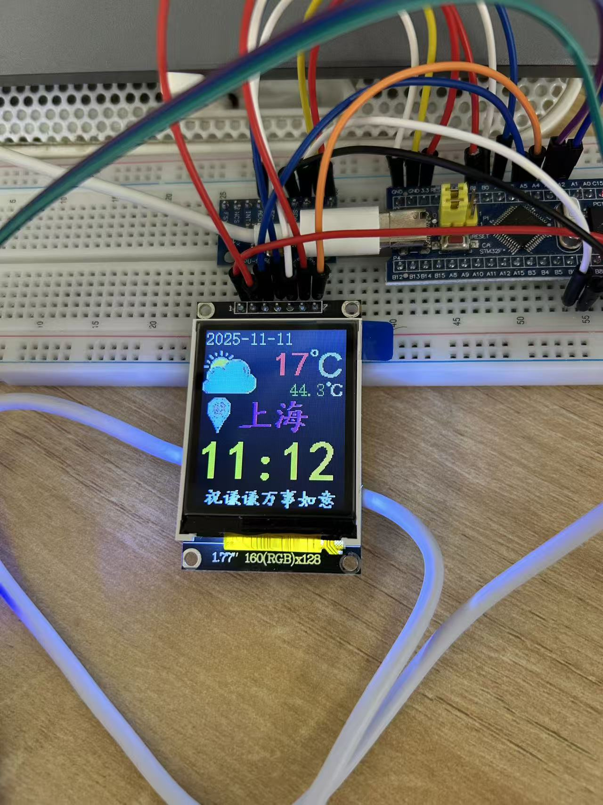

| ESP32-C3 (AT mode) | Get network weather data over WiFi |
| DS1302 / RTC | Provide real-time clock |
| NTC Thermistor | Temperature Acquisition |
| MPU6050 | Accelerometer sensor for attitude detection or interface switching |
| DuPont Cable / Power Module | Hardware Connectivity & Power |

---

## 🧠 Software Structure

The project adopts a hierarchical design, separating the driver layer from the application layer, and the code structure is clear and maintainable.

stm32f103c8-project/
├── app/ # Application layer logic
│ ├── main.c
│ ├── weather.c
│ ├── rtc.c
│ ├── mpu6050.c
│ └── led.c
├── drivers/ # The underlying driver layer
│ ├── st7735.c
│ ├── lcd_spi.c
│ ├── esp_at.c
│ └── delay.c
├── fonts/ # Font library and font drawing
├── images/ # Image resources
├── inc/ # header file
├── utils/ # Tool functions
└── main.h

---

## 🛰️ Functional features

✅ Real-time clock display (year, month, day, hour, minute, second)  
✅ Get real-time weather (temperature, weather status) via WiFi  
✅ Automatically switches the °C unit display  
✅ Acceleration detection triggers interface changes  
✅ LCD screen dynamic refresh and adaptive display layout  
✅ Power off time data is saved  
✅ Modular drive and clear structure

---

## 📸 Effect display

| Interface | Example |
|------|------|
| ⏰ Clock Interface |  |

---

## Wiring

STM32:PA2->ESP32:IO6
STM32:PA3->ESP32:IO7
STM32:GND->ESP32:GND  ST7735:GND| ESP32-C3 (AT mode) | Get network weather data over WiFi |
| DS1302 / RTC | Provide real-time clock |
| NTC Thermistor | Temperature Acquisition |
| MPU6050 | Accelerometer sensor for attitude detection or interface switching |
| DuPont Cable / Power Module | Hardware Connectivity & Power |

---

